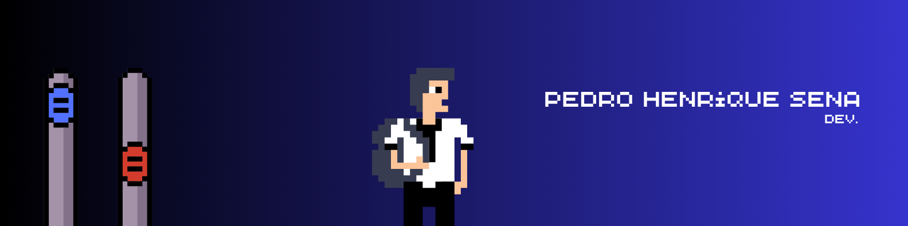

  

<h1 align="center">Java • Spring Boot • Python • SQL</h1>

  
  
  

---

### 👋 Sobre mim

Sou o Pedro! Tenho 19 anos, moro em São Paulo - SP e estou cursando **Análise e Desenvolvimento de Sistemas na FIAP**.  
Me formei como **Técnico em Informática para Internet** pela ETEC São Mateus e, desde os 14 anos, vivo com a cabeça na tecnologia 🚀

Gosto de criar, testar, errar, aprender e **colocar a mão no código**. Meu foco hoje é crescer como desenvolvedor full stack, unindo boas práticas, performance e criatividade.

---

<h2 align="center">🧰 Tecnologias que estudo e utilizo</h2>

  
  
  
  
  
  

---

<h2 align="center">🚧 Projetos em Destaque</h2>

<table>
  <tr>
    <td align="center" width="45%">
      <h3>🚉 Future Station</h3>
      

        Análise de horários de pico nas linhas 4, 8 e 9 do metrô de São Paulo.  
        
      

    </td>
    <td align="center" width="45%">
      <h3>🌐 Somos+</h3>
      

        Plataforma que conecta pessoas em vulnerabilidade com empresas e ONGs.  
        
      

    </td>
  </tr>
</table>

---

<h2 align="center">📊 GitHub Stats</h2>

  

---

  💻 Codando com propósito, aprendendo com café e vivendo sem bug (ou tentando).

